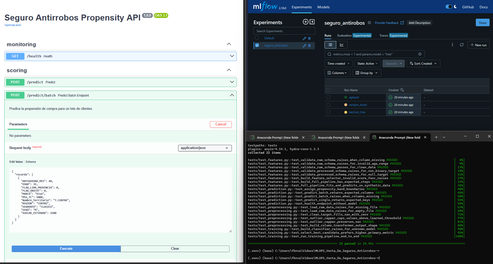

# Seguro Antirrobos — Modelo de Propensión a la Compra (MLOps)



Pipeline productivo, modular y reproducible que predice qué clientes de tarjeta
de crédito tienen mayor probabilidad de aceptar el **Seguro Antirrobos**
(coberturas: billetera S/.50, celular S/.350, laptop S/.680), construido a
partir del EDA exploratorio en [`notebooks/Caso Venta de Seguros
antirrobos.ipynb`](notebooks/Caso%20Venta%20de%20Seguros%20antirrobos.ipynb).

> **¿Solo quieres correrlo y verlo funcionar?** Ve directo a la sección [2. Quick Start](#2-quick-start-5-minutos). No se necesita Docker.

## Índice

1. [Descripción del proyecto](#1-descripción-del-proyecto)
2. [Quick Start (5 minutos)](#2-quick-start-5-minutos)
3. [Qué hace cada comando](#3-qué-hace-cada-comando)
4. [Docker (opcional, no necesario para revisar)](#4-docker-opcional-no-necesario-para-revisar)
5. [Estructura del repositorio](#5-estructura-del-repositorio)
6. [Arquitectura del pipeline](#6-arquitectura-del-pipeline)
7. [Resultados](#7-resultados)
8. [Re-entrenamiento](#8-re-entrenamiento)

---

## 1. Descripción del proyecto

- **Variable objetivo:** `FLAG_SS` (1 = compró/aceptó el seguro, 0 = no). En el
  dataset crudo el "no" se representa como valor vacío; el pipeline lo
  convierte a `0` explícitamente en `src/features/preprocessing.py::clean_target`.
- **Problema de negocio:** dataset con fuerte desbalance de clases (~2.6% de
  positivos). Perder una venta (falso negativo) cuesta más que contactar a
  alguien que no compra (falso positivo), por lo que la **métrica principal
  es Recall** de la clase positiva, con **ROC-AUC** como desempate.
- **Modelos comparados:** Decision Tree, Random Forest y XGBoost, entrenados
  y registrados automáticamente en MLflow; el pipeline selecciona el mejor
  según `evaluation.primary_metric` en `params.yaml`.
- **Salida del modelo:** probabilidad de compra + banda de propensión
  (`alta` ≥ 0.70, `media` ≥ 0.50, `baja` < 0.50), para priorizar campañas
  comerciales.

## 2. Quick Start (5 minutos)

Todo se ejecuta desde la raíz del proyecto, en una terminal (Git Bash, PowerShell o cmd).

### Paso 0 — Requisitos

- Python 3.11 o 3.12 instalado (`python --version`).
- Nada más. No se necesita Docker, ni una base de datos, ni servicios externos.

> ⚠️ **Si tienes Anaconda/Miniconda instalado:** el comando `python` puede
> apuntar a esa instalación en vez de a Python 3.11/3.12, y suele fallar al
> crear el entorno virtual (`ensurepip` roto) o ser una versión muy antigua
> (incompatible con pandas/scikit-learn). Verifica primero con
> `python --version`. Si no marca 3.11 o 3.12, busca la ruta del Python
> correcto (`where python` lista todas las instalaciones) y úsala explícita
> en el paso siguiente, ej.: `"C:\...\Python312\python.exe" -m venv .venv`.

### Paso 1 — Crear entorno virtual e instalar dependencias (~2 min)

```bash
python -m venv .venv
source .venv/Scripts/activate      # Git Bash
# .venv\Scripts\Activate.ps1       # PowerShell
# .venv\Scripts\activate.bat       # cmd.exe

pip install -r requirements.txt
```

**Resultado esperado:** termina sin errores. Si usas PowerShell y el `Activate.ps1`
da error de permisos, ejecuta antes: `Set-ExecutionPolicy -Scope Process RemoteSigned`.

### Paso 2 — Ejecutar el pipeline completo (~30 seg)

```bash
dvc repro
```

Esto corre, en orden, las 4 etapas declaradas en `dvc.yaml`:
`validate → split → train → evaluate`.

**Resultado esperado:** en la consola verás el entrenamiento de los 3 modelos y,
cerca del final, una línea como:

```
Modelo seleccionado: random_forest (recall=0.30, roc_auc=0.79)
```

y al terminar: `Use 'dvc push' to send your updates to remote storage.`
(ese mensaje es genérico de DVC; este proyecto no usa un remote externo —el
dataset crudo viaja versionado directamente en Git— así que se puede ignorar).

> Si prefieres correr cada etapa por separado (más explícito para explicarle
> a alguien paso a paso): `python main.py validate`, luego `split`, `train`,
> `evaluate` (ver [sección 3](#3-qué-hace-cada-comando)).

### Paso 3 — Ver los experimentos en MLflow

```bash
mlflow ui --backend-store-uri mlruns
```

Abrir [http://127.0.0.1:5000](http://127.0.0.1:5000). Ahí se ven los 3 runs
(`decision_tree`, `random_forest`, `xgboost`) con sus métricas, matriz de
confusión, curva ROC y el modelo serializado como artefacto.

### Paso 4 — Levantar la API y probarla

En otra terminal (con el mismo entorno activado):

```bash
uvicorn src.api.app:app --reload --host 0.0.0.0 --port 8000
```

Abrir [http://127.0.0.1:8000/docs](http://127.0.0.1:8000/docs) — Swagger
interactivo, se puede probar `/predict` desde el navegador sin escribir código.

O por línea de comandos:

```bash
curl -X POST http://localhost:8000/predict \
  -H "Content-Type: application/json" \
  -d '{
        "Mto_TC": 5000, "MARCA": "Visa", "Nombre_territorio": "T.CENTRO",
        "FLAG_LIMA_PROVINCIA": 0, "REGION": "CENTRO", "SUELDO_ESTIMADO": 2500,
        "EDAD": 35, "SEXO": "M", "ANTIGUEDAD_MES": 48, "SEGMENTO": "CLASICO",
        "FLAG_UNICEF": 0
      }'
```

**Resultado esperado:**

```json
{"prediction": 0, "probability": 0.03, "propensity_band": "baja"}
```

### Paso 5 — Correr las pruebas automatizadas

```bash
pytest -v
```

**Resultado esperado:** `22 passed`.

---

## 3. Qué hace cada comando

| Comando | Etapa | Qué produce |
|---|---|---|
| `python main.py validate` | Valida el CSV crudo (columnas, tipos, rangos de negocio) | Nada en disco; falla si el dataset está corrupto |
| `python main.py split` | Divide 70/15/15 en train/validation/test, estratificado | `data/processed/{train,validation,test}.csv` |
| `python main.py train` | Entrena Decision Tree, Random Forest y XGBoost; compara y selecciona el mejor; registra todo en MLflow | `models/model.pkl`, `models/model_metadata.json`, `reports/figures/validation/*.png`, `reports/train_metrics.json` |
| `python main.py evaluate` | Evalúa el modelo elegido contra el test set (nunca visto en entrenamiento) | `reports/test_metrics.json`, `reports/figures/test/*.png` |
| `dvc repro` | Ejecuta las 4 anteriores en orden, saltando las que no cambiaron | Todo lo anterior + `dvc.lock` |
| `mlflow ui` | Levanta el dashboard de experimentos | — |
| `uvicorn src.api.app:app` | Levanta la API REST que sirve `models/model.pkl` | — |
| `pytest` | Corre 22 tests unitarios/integración sobre datos sintéticos | — |

## 4. Docker (opcional, no necesario para revisar)

El `Dockerfile` empaqueta la API + el modelo entrenado en una imagen portable
para desplegar en un servidor o Kubernetes — es la práctica de "despliegue
reproducible" que exige el curso. **No es necesario para que un profesor
revise el proyecto**: requiere tener Docker Desktop corriendo y construir la
imagen toma varios minutos, contra segundos de la Opción A.

Si de todas formas se quiere probar (requiere haber corrido `dvc repro` antes,
para que exista `models/model.pkl`):

```bash
docker build -t seguro-antirobos-mlops:latest .
docker run -p 8000:8000 seguro-antirobos-mlops:latest
# misma API en http://localhost:8000/docs
```

## 5. Estructura del repositorio

```
my-ml-project/
├── data/
│   ├── raw/DS_Seguro_Antirobos.csv        # dataset original (versionado en Git)
│   └── processed/{train,validation,test}.csv
├── notebooks/                              # EDA original, ya no es la solución productiva
├── docs/                                   # diccionario de datos, PDF del curso, presentación
├── src/
│   ├── config.py, logging_setup.py, exceptions.py
│   ├── features/
│   │   ├── data_validation.py              # esquema y rangos de negocio
│   │   ├── preprocessing.py                # carga, limpieza de target, OutlierCapper, ColumnTransformer
│   │   ├── feature_engineering.py          # SelectKBest + ensamblado del pipeline completo
│   │   └── split_data.py                   # train/validation/test estratificado
│   ├── models/
│   │   ├── train.py, evaluate.py, predict.py, metrics.py
│   │   └── mlflow_tracking.py, save_model.py
│   └── api/
│       ├── app.py, routes.py, schemas.py
├── tests/                                  # pytest: preprocesamiento, features, entrenamiento, predicción
├── configs/config.yaml, configs/logging.yaml
├── models/, reports/figures/               # artefactos generados por el pipeline
├── Dockerfile, dvc.yaml, params.yaml, requirements.txt, setup.py, Makefile
└── main.py                                 # CLI: validate | split | train | evaluate | predict
```

## 6. Arquitectura del pipeline

```
Raw CSV → validate → split (train/val/test) → train (compara 3 modelos + MLflow)
        → selección automática del mejor modelo → evaluate (test set) → API FastAPI
```

Cada modelo candidato se entrena dentro de un único `imblearn.pipeline.Pipeline`:

```
OutlierCapper (p99, aprendido solo en train) → ColumnTransformer (impute + one-hot)
→ SelectKBest (f_classif) → SMOTE (solo durante fit) → Clasificador
```

Ese pipeline completo se serializa como un solo artefacto (`models/model.pkl`),
de modo que la API de inferencia no reimplementa ninguna lógica de limpieza:
carga el pickle y llama `.predict()` / `.predict_proba()` directamente.

## 7. Resultados

| Modelo         | AUC-ROC | F1   | Recall | Precision |
|----------------|---------|------|--------|-----------|
| Decision Tree  | 0.65    | 0.09 | 0.19   | 0.06      |
| Random Forest  | 0.79    | 0.45 | 0.30   | 0.87      |
| XGBoost        | 0.72    | 0.06 | 0.04   | 0.14      |

*(valores del set de validación en la última corrida local; pueden variar
ligeramente entre corridas por el muestreo de SMOTE). Random Forest es
seleccionado automáticamente por su balance entre Recall y Precision —
mismo modelo elegido en el notebook exploratorio original.*

## 8. Re-entrenamiento

Disparadores recomendados (ver `params.yaml -> evaluation` para umbrales):

1. **Por métrica:** Recall en test cae por debajo del umbral acordado con negocio.
2. **Por calendario:** cada 6 meses, según el hallazgo del EDA de que el drift
   es detectable a partir de ese horizonte.
3. **Por volumen:** al acumular un número mínimo de nuevas etiquetas (ventas
   confirmadas) desde el último entrenamiento.

Proceso: colocar datos frescos en `data/raw/`, correr `dvc repro`, revisar
`reports/test_metrics.json` y el run de MLflow antes de promover el nuevo
`models/model.pkl` a producción.

---

## Referencias

- Diccionario de datos: [`docs/Diccionario de Seguro Antirobos.xlsx`](docs/Diccionario%20de%20Seguro%20Antirobos.xlsx)
- Documento del curso: [`docs/Integración y Proyecto Final.pdf`](docs/Integración%20y%20Proyecto%20Final.pdf)
- MLflow: mlflow.org/docs/latest · DVC: dvc.org/doc · FastAPI: fastapi.tiangolo.com
